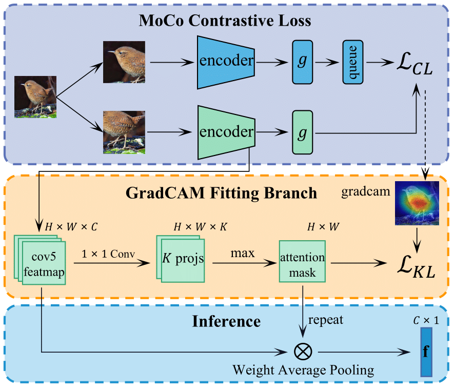

# Learning Common Rationale to Improve Self-Supervised Representation for Fine-Grained Visual Recognition Problems 
 
This project contains the implementation of learning common rationale to improve self-supervised representation for fine-grained visual recognition, as presented in our paper

> Learning Common Rationale to Improve Self-Supervised Representation for Fine-Grained Visual Recognition Problems,   
> Yangyang Shu, Anton van den Hengel and Lingqiao Liu*  
> *CVPR 2023*

## Datasets
| Dataset | Download Link |
| -- | -- |
| CUB-200-2011 | https://paperswithcode.com/dataset/cub-200-2011 |
| Stanford Cars | http://ai.stanford.edu/~jkrause/cars/car_dataset.html |
| FGVC Aircraft | http://www.robots.ox.ac.uk/~vgg/data/fgvc-aircraft/ |


Please download and organize the datasets in this structure:
```
LCR
├── CUB200/
│   ├── train/ 
    ├── test/
├── StanfordCars/
│   ├── train/ 
    ├── test/
├── Aircraft/
│   ├── train/ 
    ├── test/
```

# For byol
Install the required packages:
```
pip install -r requirements.txt
```

## RUN
- The running commands for several datasets are shown below. You can also refer to ``run_all.sh``.
```
python main.py --data_dir ./CUB200 --log_dir ./logs/ -c configs/byol_cub200.yaml --ckpt_dir ./.cache/ --hide_progress
python main.py --data_dir ./StanfordCars --log_dir ./logs/ -c configs/byol_stanfordcars.yaml --ckpt_dir ./.cache/ --hide_progress
python main.py --data_dir ./Aircraft --log_dir ./logs/ -c configs/byol_aircrafts.yaml --ckpt_dir ./.cache/ --hide_progress

```

# For moco v2

- The running commands for pre-training and retrieval
```
python main_moco.py --epochs 100 -a resnet50 --lr 0.03 --batch-size 128 --multiprocessing-distributed --world-size 1 --rank 0 Aircraft --mlp --moco-t 0.2 --aug-plus --cos 
python main_moco.py --epochs 100 -a resnet50 --lr 0.03 --batch-size 128 --multiprocessing-distributed --world-size 1 --rank 0 StanfordCars --mlp --moco-t 0.2 --aug-plus --cos 
python main_moco.py --epochs 100 -a resnet50 --lr 0.03 --batch-size 128 --multiprocessing-distributed --world-size 1 --rank 0 CUB200 --mlp --moco-t 0.2 --aug-plus --cos 
```

- The running commands for linear probing
```
python main_lincls.py -a resnet50 --lr 30.0 --batch-size 256 --[your checkpoint path]/checkpoint_****.pth.tar --dist-url 'tcp://localhost:10001' --multiprocessing-distributed --world-size 1 --rank 0   Aircraft --class_num 100
python main_lincls.py -a resnet50 --lr 30.0 --batch-size 256 --[your checkpoint path]/checkpoint_****.pth.tar --dist-url 'tcp://localhost:10001' --multiprocessing-distributed --world-size 1 --rank 0   StanfordCars --class_num 196
python main_lincls.py -a resnet50 --lr 30.0 --batch-size 256 --[your checkpoint path]/checkpoint_****.pth.tar --dist-url 'tcp://localhost:10001' --multiprocessing-distributed --world-size 1 --rank 0   CUB200 --class_num 200
```

Citation
If you find this code or idea useful, please cite our work:
```
@inproceedings{shu2023learning,
  title={Learning Common Rationale to Improve Self-Supervised Representation for Fine-Grained Visual Recognition Problems},
  author={Shu, Yangyang and van den Hengel, Anton and Liu, Lingqiao},
  booktitle={Proceedings of the IEEE/CVF Conference on Computer Vision and Pattern Recognition},
  pages={11392--11401},
  year={2023}
}
```


